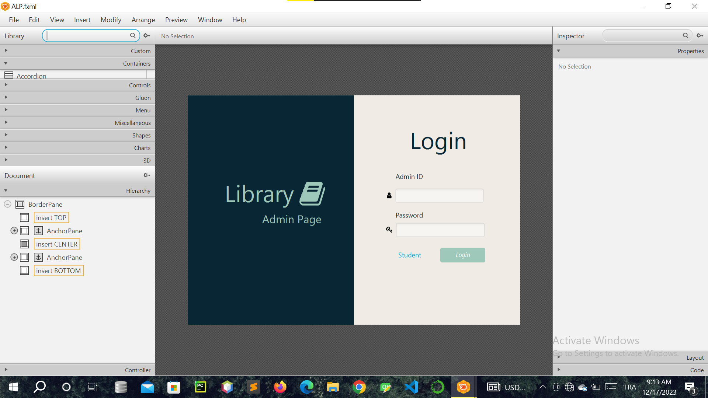

# IHM Project

Welcome to the repository for my IHM (Interface Homme-Machine) project! This repository showcases my work in designing and developing user interfaces that enhance user experience.

## Table of Contents
- [Project Overview](#project-overview)
- [Technologies Used](#technologies-used)
- [Screenshots](#screenshots)
- [Installation](#installation)
- [Usage](#usage)
- [Contact](#contact)

## Project Overview
This project focuses on creating an intuitive user interface that facilitates effective interaction between humans and machines. The main objectives include:
- Improving usability and accessibility.
- Implementing best practices in UI/UX design.

## Technologies Used
- **xml**
- **CSS**

## Screenshots
Here are some screenshots of the project in action:

